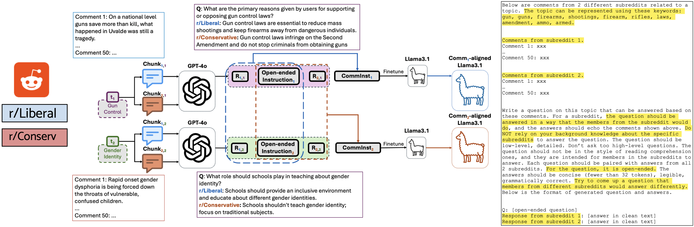

# Community-Cross-Instruct
This repo is the implementation of our [paper](https://aclanthology.org/2024.emnlp-main.945/) "Community-Cross-Instruct: Unsupervised Instruction Generation for Aligning Large Language Models to Online Communities". We introduce Community-Cross-Instruct, an unsupervised framework that leverages instruction-tuning with advanced LLMs to create and evaluate digital twins of online communities.


Illustration of our framework using a toy example, where there are two subreddits r/Liberal and r/Conservative, and we focus on the topic gun control.

## Datasets: CommInst and CommSurvey
```
3_instruction_generation/CommInst
3_instruction_generation/CommSurvey
```


## (Optional) 1. Data Processing
1. Download the [comments/submissions](https://drive.google.com/drive/folders/12vXVlVJlHvHoKdF18CwViFbMBmpl6kka?usp=share_link) to *1_reddit_data_processing/data*.

2. Generate the embeddings of the comments/submissions.
```
cd 1_reddit_dataprocessing
bash run_compute_embeds.sh
```

## (Optional) 2. Topic Modeling
If GPUs are available, install [CUML](https://docs.rapids.ai/install/) before running the topic modeling.
```
cd 2_topic_modeling
bash run_topic_modeling.sh
```

## (Optional) 3. Unsupervised Instruction Generation
Generate prompts to query advanced LLMs.
```
cd 3_instruction_generation
bash run_construct_prompts.sh
```
Alternatively, you can simple unzip *prompts.zip*.

The generated prompts will be saved at *3_instruction_generation/prompts*. The prompts can be used to query advanced LLMs, such as GPT-4o or Claude-3. The resulting datasets (after processing) CommInst and CommSurvey are already provided.

## 4. Experiments on Llama-3.1

We use [Llama-Factory](https://github.com/hiyouga/LLaMA-Factory/tree/main) to finetune and run inference from open-source LLMs. We highly recommend familiarizing yourself with Llama-Factory first.

Below we give an example for r/Liberal in the politics domain. We  ensure that there is no topic overlap in this case.

### Finetuning
1. Register the CommInst dataset *4_experiments_llama3.1/data_for_ft/politics/instructions_Liberal_open_ended_train_by_topic.json* in [*dataset_info.json*](https://github.com/hiyouga/LLaMA-Factory/blob/main/data/dataset_info.json).
2. Use the config file *4_experiments_llama3.1/configs_for_ft/politics/Liberal_open_ended_train_by_topic.yaml* to start the finetuning process.

### Inference
1. Register the CommSurvey dataset *4_experiments_llama3.1/data_for_inference/politics/instructions_Liberal_multi_choice_test_by_topic.json* in [*dataset_info.json*](https://github.com/hiyouga/LLaMA-Factory/blob/main/data/dataset_info.json).
2. Use the config file *4_experiments_llama3.1/configs_inference/politics/Liberal_multi_choice_test_by_topic.yaml* to run inference.


## 4. Experiments on GPT-3.5

### Finetuning
We use the OpenAI [finetuning API](https://platform.openai.com/docs/guides/fine-tuning) to finetune GPT-3.5. The finetuning data are at *5_experiments_gpt3.5/data_for_ft*.

### Inference
 After fientuning, we use the [batch API](https://platform.openai.com/docs/guides/batch) to run inference. The inference data are at *5_experiments_gpt3.5/data_for_inference*.


 ## Citation
```bibtex
@inproceedings{he2024community,
  title={Community-Cross-Instruct: Unsupervised Instruction Generation for Aligning Large Language Models to Online Communities},
  author={He, Zihao and Chu, Minh and Dorn, Rebecca and Guo, Siyi and Lerman, Kristina},
  booktitle={Proceedings of the 2024 Conference on Empirical Methods in Natural Language Processing},
  pages={17001--17019},
  year={2024}
}
```